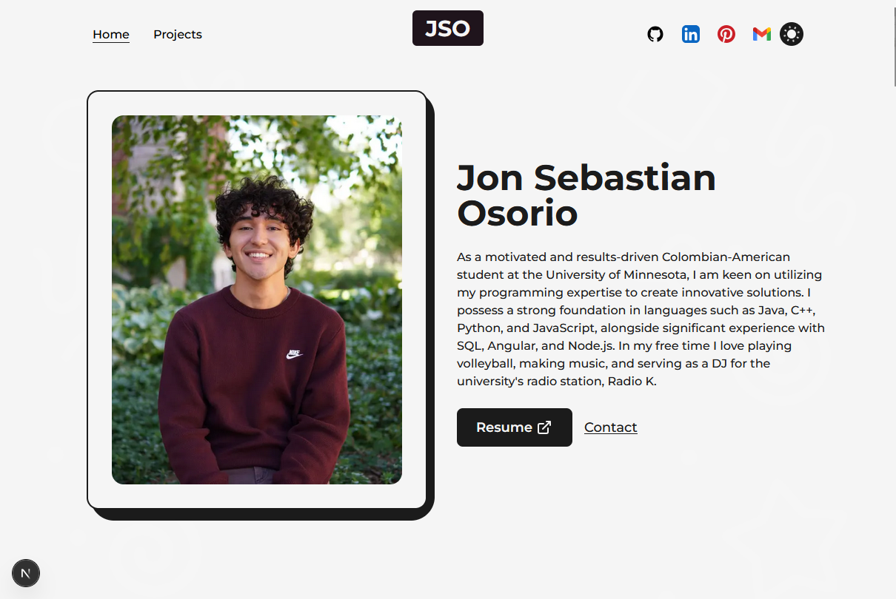

# JSO NextJS Portfolio

My modern portfolio website showcasing my professional experience, projects, and skills.

### Live Website: https://jseboso.com/



## Features

- Responsive design that works on all devices
- Dark/light mode toggle with system preference detection
- Animated page transitions and UI elements
- Interactive components built with Framer Motion
- Sections for biography, work experience, education, and projects

## Built With

- [Next.js](https://nextjs.org/) - React framework for production
- [Tailwind CSS](https://tailwindcss.com/) - Utility-first CSS framework
- [Framer Motion](https://www.framer.com/motion/) - Animation library
- [Azure Static Web Apps](https://azure.microsoft.com/services/app-service/static/) - Hosting platform

## Getting Started

### Prerequisites

- Node.js (version 16.x or higher)
- npm or yarn

### Installation

1. Clone the repository
```bash
git clone https://github.com/yourusername/portfolio.git
cd portfolio
```

2. Install dependencies
```bash
npm install
# or
yarn install
```

3. Run the development server
```bash
npm run dev
# or
yarn dev
```

4. Open [http://localhost:3000](http://localhost:3000) in your browser

## Project Structure

- `/public` - Static assets including images and PDF files
- `/src/components` - Reusable React components
- `/src/pages` - Next.js pages and routing
- `/src/styles` - Global styles and CSS modules

## Deployment

This project is configured for deployment to Azure Static Web Apps using GitHub Actions:

1. The workflow file is located in `.github/workflows/`
2. When code is pushed to the main branch, it automatically builds and deploys to Azure

## Future Improvements

- Add more interactive elements to showcase projects
- Implement a blog section for articles
- Add contact form functionality
- Optimize image loading for better performance

## Acknowledgments

- [Tailwind CSS](https://tailwindcss.com/) for the utility-first styling
- [Framer Motion](https://www.framer.com/motion/) for animations
- [Next.js](https://nextjs.org/) for the React framework
